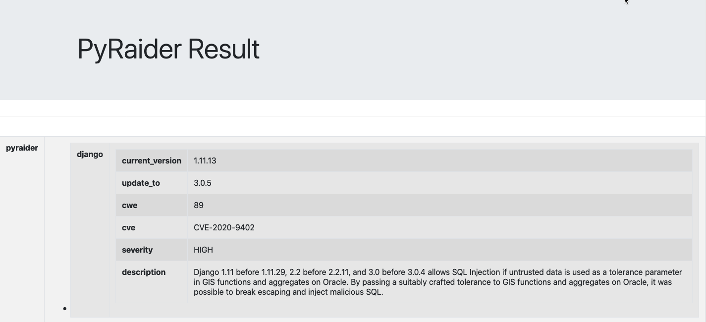

# PyRaider

> Using PyRaider You can scan installed dependencies known security vulnerabilities. It uses publicly known exploits, vulnerabilities database. [Documentation](https://pyraider.raidersource.com)

**Latest Version: 1.0.1**


                                    
## Usage

[Documentation](https://pyraider.raidersource.com/#/)

**Note:** Currently pyraider support above `python3` version .

### Install `pyraider` using pip

```commandline
pip install pyraider
```

### Once a `pyraider` you can run help command. It will show you the list commands and examples.

```commandline
pyraider -h
```

### You can use `pyraider -v` to check the version.

```commandline
pyraider -v
```
* Now `PyRaider` supports two types of scans.
    * Light scan
        * It is faster and it checks against only the latest CVE database vulnerabilities.
        * Default it will use `Light Scan`.
    * Deep Scan
        * This may take some time to download the first time. It will scan against all the CVE database vulnerabilities.
        * If you want to use `Deep Scan` need to add `-d` command. It will automatically scans against all the CVE database vulnerabilities.

##  Scan Vulnerabilities against the dependencies
> Using PyRaider you can scan the vulnerable packages.

### To run basic scan you can use `pyraider go` command. It will automatically detects the installed packages and scans against it and shows the report.

```commandline
pyraider go
```

* To Run Deep Sca

```commandline
pyraider go -d
```

**Note: If you are running this command the first time. The resource database will be downloaded. It may take some time to download. This will be downloaded only once. It won't download every time.**


### If you want to scan you packages against `requirements.txt` or `Pipfile.lock` file.

```commandline
pyraider check -f /Users/raider/project/requirements.txt
```

```commandline
pyraider check -f /Users/raider/project/Pipfile.lock
```

* To Run Deep Scan

```commandline
pyraider check -d -f /Users/raider/project/requirements.txt
```

```commandline
pyraider check -d -f /Users/raider/project/Pipfile.lock
```

### If you want to scan the packages in the same directory.

```commandline
pyraider check -f .
```

**Note: If you are running this command the first time. The resource database will be downloaded. It may take some time to download. This will be downloaded only once. It won't download every time.**

## Reports
> PyRaider currently supports `JSON`, `HTML` and `CSV` formats.

### To Export as a `JSON` file.

```commandline
pyraider check -f /Users/raider/project/requirments.txt -e json result.json
```

```commandline
pyraider check -f /Users/raider/project/Pipfile.lock -e json result.json
```


### To Export as a `CSV` file.

```commandline
pyraider check -f /Users/raider/project/requirments.txt -e csv result.csv
```

```commandline
pyraider check -f /Users/raider/project/Pipfile.lock -e csv result.csv
```

### To Export as a `HTML` file.

```commandline
pyraider check -f /Users/raider/project/requirments.txt -e html result.html
```

```commandline
pyraider check -f /Users/raider/project/Pipfile.lock -e html result.html
```



## Out of Date Pacakges
> Using PyRaider you can check the latest packages. Aginst installed packages.

```commandline
pyraider validate -f /Users/raider/project/requirments.txt
```

```commandline
pyraider validate -f /Users/raider/project/Pipfile.lock
```

* It will check out of dated packages on the actiavted virtual environment.
```commandline
pyraider validate 
```


## Auto Fix
> PyRaider also supports `auto fix` feature. Using this you can fix the vulnerable packages.

**Note:** To updating the packages might affect your application.

### Fix
> You can fix packages vulnerabilities individually. Once it is installed it will automatically update the `requirments.txt` or `Pipfile.lock` file.

```
pyraider fix
```

### Autofix
> You can also fix packages vulnerabilities at one shot. Once it is installed it will automatically update the `requirments.txt` or `Pipfile.lock` file.

```
pyraider autofix
```

### Update latest database
> Now you can update the resource database with latest updated vulnerabilities

```
pyraider updatedb
```
* To Update `Deep Scan` database  

```
pyraider updatedb -d
```

**Note: It may take some time to download.**

## Docker container
> You can also run `pyraider` has a docker container.

### Build docker container image

```
docker build -t pyraider .
```

### Author
    
* [Tilak Thimmapppa](https://tilakt.com/)

### Contribute
* We welcome contributions to this project in the form of:
    * Feature Requests, Suggestions
    * Bugs
    * Help with writing tests
    * Add-on features, plugins, etc
    * Documentation

### Contact us:
* Email : tilaknayarmelpal@gmail.com
* Twitter : https://twitter.com/ti1akt